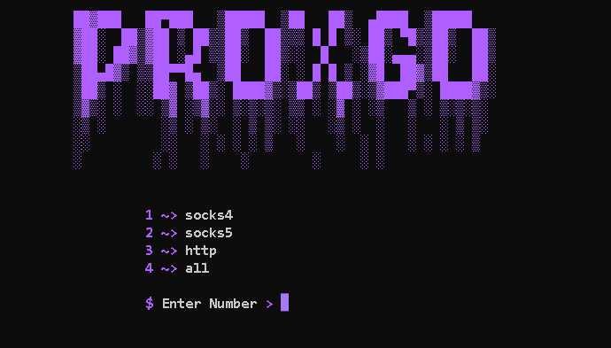

<h1 align="center">
  </a>
  <br>
</h1>

<h4 align="center">Simple Go Proxy Scraper.</h4>

<p align="center">
  <a href="#features">Features</a> •
  <a href="#installation">Install</a> •
  <a href="#running-faqCombo">Usage</a> •
</p>

---


ProxGo is a tool developed to provide you with all types of proxies for your scraping needs. ProxGo was made just to get hands-on Go Language. So this tool is so simple, i will come back later.

# Features

<h1 align="left">
  </a>
  <br>
</h1>

 - super fast scraper
 - super cool ui
 - socks4,socks5,http,all

# Usage

```sh
go run .
```

To install run these comands:

```sh
▶ git clone https://github.com/SalmanAlwann/ProxGo.git
```
```sh
▶ cd ProxGo
▶ go run .
```

# Running faqCombo

To run the tool, just use the following command.

```sh
▶ go run .
```
